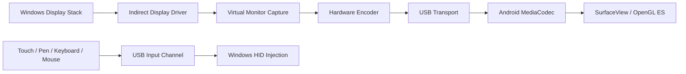

# Architecture

USBDisplay has three independent runtime components.

## Windows Driver

The IDD is responsible for monitor identity, EDID, modes, hot plug, and display topology. It is the reason Windows can extend, duplicate, rotate, and drag windows onto the tablet.

The driver is implemented and enumerates a virtual `USBDisplay` monitor today.
It captures the monitor's composed contents by reading back the swap-chain
surface it is handed each frame; the hardware encoder consumes that same surface
in a later slice. See [idd-driver.md](idd-driver.md) for detail.

## Host Streaming Service

The host service owns:

- Android device discovery
- Stream negotiation
- Virtual monitor capture
- Hardware encoder selection
- USB transport
- Telemetry-free diagnostics
- Input return path

Capture must target the virtual monitor only.

## Android Client

The Android client owns:

- USB handshake
- MediaCodec decoder lifecycle
- Frame pacing
- Adaptive buffering
- Surface rendering
- Touch, pen, keyboard, and mouse event capture

The Android UI thread must never block on decode, USB, or rendering.

